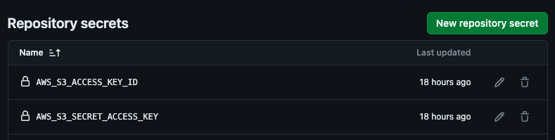

[Original Repository - codesbiome/react-webpack-typescript-2023](https://github.com/codesbiome/react-webpack-typescript-2023)

<br><br>

# React Boiler Plate

gyechunsik.site React Boiler Plate

# FILL HERE 검색해서 수정하면 됩니다

프로젝트 root 에서 <code>FILL HERE</code> 을 검색해서 각 항목에 맞게 알맞은 값을 적어넣으면 됩니다.  
또는 아래 세팅 방법을 따라한 뒤에 <code>FILL HERE</code> 을 검색해서 빠뜨린 항목이 없는지 체크하시면 됩니다.

# Boilerplate Template 프로젝트 사용 전 세팅

1. git 초기화
2. 정적 파일 서버 URL 설정
3. 프로젝트 이름 및 버전 재설정
4. Github Actions Scripte 수정 - S3 저장 경로 변경

## 1. git 초기화

```
# Project Root directory 로 이동
rm -rf ./.git
```

```
git init
```

```
git add .
git commit -m "init commit"
git remote add origin <원격 저장소 url>
git push --force --set-upstream origin main
```

## 2. 정적 파일 서버 URL 설정

CSS JS image 등 정적 파일이 S3 Bucket에 저장될 디렉토리를 지정해준다.  
예를 들어 아래와 같은 URL로 정적 파일이 위치하게 된다.

```
"https://static.gyechunsik.site/scoreboard/admin/index.html";
```

```html
<link
  rel="icon"
  href="https://static.gyechunsik.site/scoreboard/admin/logo.png"
/>
```

정적 파일 URL 을 매칭시켜주려면 homepage 설정을 해줘야 한다.

<code>package.json</code> 에서 <code>scripte "aws-build"</code> 를 수정해주면 된다.

```json
"scripts": {
  "start": "cross-env NODE_ENV=development webpack serve --config tools/webpack/webpack.config.dev.js",
  ...
  "aws-build": "cross-env PUBLIC_URL=https://static.gyechunsik.site/scoreboard/admin/ NODE_ENV=production SAME_ORIGIN=true webpack --config tools/webpack/webpack.config.prod.js",
},
```

위 에서 <code>PUBLIC_URL=https://static.gyechunsik.site/scoreboard/admin/</code> 부분을 원하는 디렉토리에 맞춰서 수정해주면 된다.  
S3 업로드 경로는 <code>package.json</code> 수정으로는 변경되지 않는다.  
직접 github actions script 에서 동일한 url 로 매칭되도록 설정해야 한다.

## 3. 프로젝트 이름 및 버전 재설정

<code>package.json</code> 의 최 상단부터 name, version, description, license(optional)를 프로젝트에 맞춰 수정한다.

```json
{
  "name": "scoreboard-admin",
  "version": "1.0.0",
  "description": "scoreboard-admin page to manage football api",
  "license": "MIT",
  ...
}
```

## 4. Github Actions Scripte 수정 - S3 저장 경로 변경

```
- name: Deploy to S3
  run: |
    aws s3 rm s3://gyechunsik-scoreboard/boilerplate/ --exclude "*/*"
    aws s3 sync ./dist/ s3://gyechunsik-scoreboard/boilerplate/ --exclude "assets/*"
    aws s3 sync ./dist/assets/ s3://gyechunsik-scoreboard/boilerplate/assets/ --delete --size-only
  env:
    AWS_ACCESS_KEY_ID: ${{ secrets.AWS_S3_ACCESS_KEY_ID }}
    AWS_SECRET_ACCESS_KEY: ${{ secrets.AWS_S3_SECRET_ACCESS_KEY }}
    AWS_DEFAULT_REGION: 'ap-northeast-2'

```

위에서 aws s3 \_\_\_ s3://... 3줄에 대해  
프로젝트 build file 이 위치할 경로에 맞춰 수정해주면 된다.  
Github Actions 에 의해서 S3에 저장되는 파일은 <code>npm run aws-build</code> 에 의해 빌드된 dist 폴더 하위의 빌드 결과물 파일들이다.

## 5. Repository Secrets 에 AWS KEY 추가

Github Actions 가 S3 에 접근 권한을 가질 수 있도록 access key 를 저장해둬야 한다.  
AWS IAM 에서 Access key id 와 Secret access key 쌍을 발급받고 Github Repository Secrets 에 AWS Key를 등록해두면 된다.

AWS IAM 에서 Access Key 발급은 다른 글을 참조.

발급받은 key 를 해당 repository secrets 에 등록해두면 된다.  
이 때 주의할 점은 key 이름이 일치해야 한다.

### 1) secrets 로 이동 후 key 등록

해당 프로젝트 repository - settings - Secrets and variables - Actions - "New repository secret"

### 2) Actions script 에 적어둔 이름과 일치하도록 secret 변수 이름 생성



위와 같이 각각 key 변수 이름을 설정해뒀다면,  
github actions scripte 에서는 아래와 같이 사용해야 한다.  
<code>secrets.AWS_S3_ACCESS_KEY_ID</code>  
<code>secrets.AWS_S3_SECRET_ACCESS_KEY</code>

```
- name: Deploy to S3
  run: |
    aws s3 rm s3://gyechunsik-scoreboard/boilerplate/ --exclude "*/*"
    aws s3 sync ./dist/ s3://gyechunsik-scoreboard/boilerplate/ --exclude "assets/*"
    aws s3 sync ./dist/assets/ s3://gyechunsik-scoreboard/boilerplate/assets/ --delete --size-only
  env:
    AWS_ACCESS_KEY_ID: ${{ secrets.AWS_S3_ACCESS_KEY_ID }}
    AWS_SECRET_ACCESS_KEY: ${{ secrets.AWS_S3_SECRET_ACCESS_KEY }}
    AWS_DEFAULT_REGION: 'ap-northeast-2'
```

스크립트에는 기본적으로 위와 동일한 변수명을 사용하도록 되어있으니,  
별 다른 이유가 없다면 위와 동일한 이름으로 github secrets 를 저장하면 됩니다.

<br><br><br>

---

<br><br><br>

# 개발용 HTTPS 인증 키 생성

## 프론트(React)용 .pem key 생성

로컬 개발용 인증 키를 mkcert 를 사용해서 발급받아 사용하세요.

```
brew install mkcert
```

```
mkcert -install
```

```
mkcert localhost
```

이후 home 경로 <code>/Users/사용자이름</code> 에 생성된 localhost-key.pem 파일과 localhost.pem 파일을 프로젝트 root 경로로 이동합니다.

## 백엔드(Spring)용 .p12 keystore 생성

이후 동일한 CA 로 부터 인증받은 p12 키를 생성해야지 로컬 개발에서 에러가 발생하지 않습니다.

```
openssl pkcs12 -export -in localhost.pem -inkey localhost-key.pem -out keystore.p12 -name [alias] -CAfile rootCA.pem -caname root
```

위에서 alias 를 기억해두도록 합니다. 키 이름에 사용되며 마치 로그인 시 id-password 에서 id 에 해당하는 게 alias 라고 생각하면 됩니다.  
위 명령을 입력하고 나면 아래와 같이 패스워드 입력 메세지가 출력됩니다.

```
Enter Export Password:
Verifying - Enter Export Password:
```

패스워드 입력, 동일 패스워드 verify 를 통과하고 나면 홈 디렉토리 <code>cd ~</code> 에서 keystore.p12 파일을 찾아 backend spring project 의 main/resources 에 위치시키고 dev 용 key 파일을 설정을 채워넣습니다.

```
application-dev.yml
```

```
server:
  port: 8083
  ssl:
    key-store: classpath:keystore.p12
    key-store-password: yourpassword
    key-store-type: PKCS12
    key-alias: alias
    enabled: true
```

예를 들어 alias = scoreboard , password = 123456 이라고 했다면

```
server:
  port: 8083
  ssl:
    key-store: classpath:keystore.p12
    key-store-password: 123456
    key-store-type: PKCS12
    key-alias: scoreboard
    enabled: true
```

으로 입력하면 됩니다.
